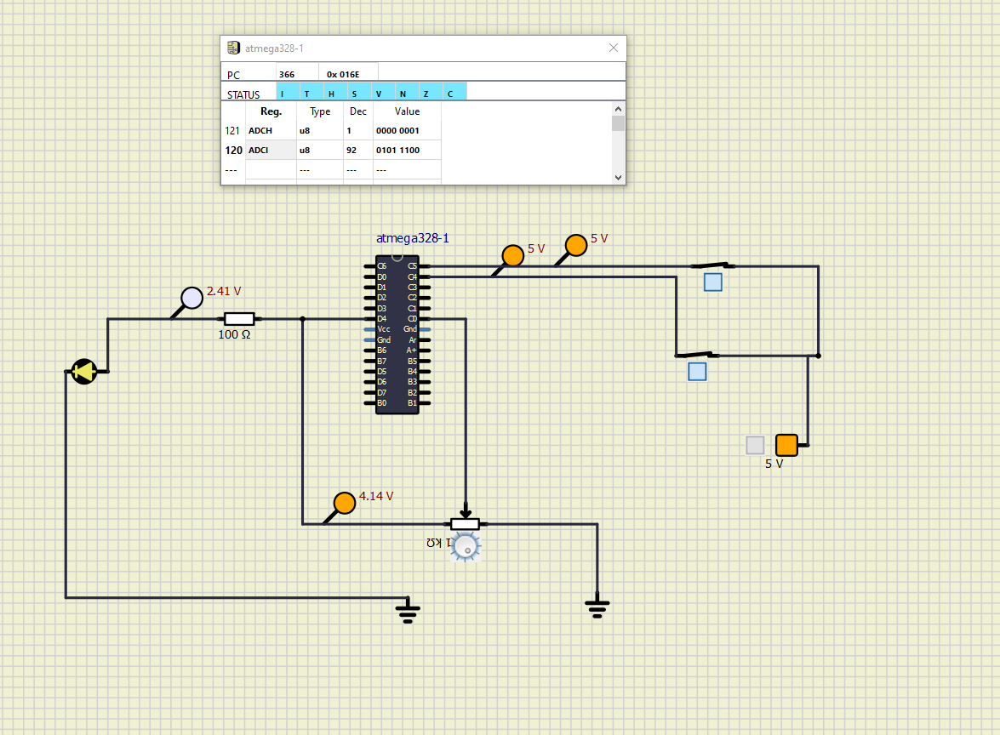
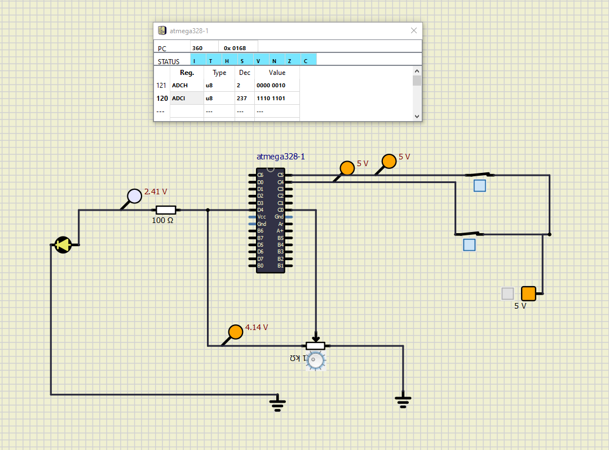
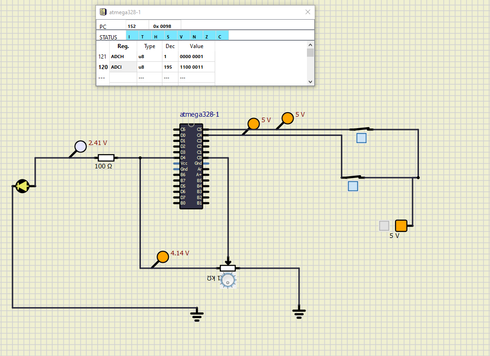
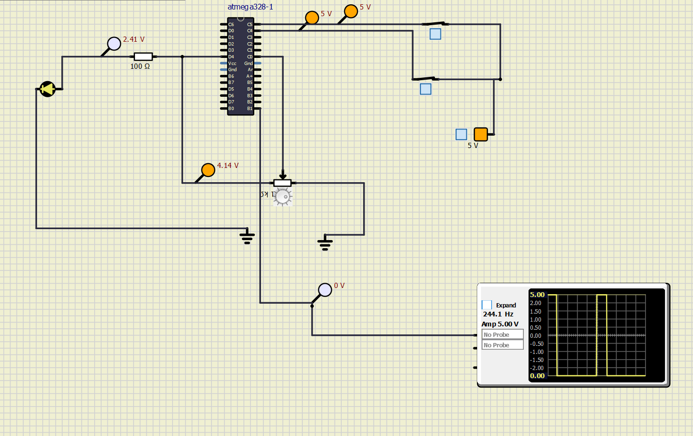
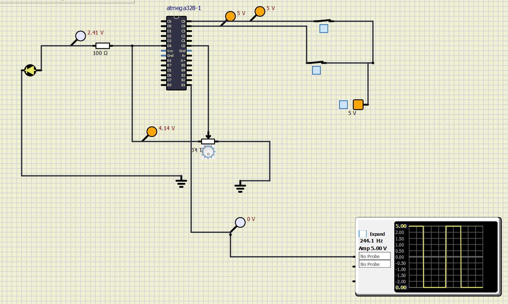
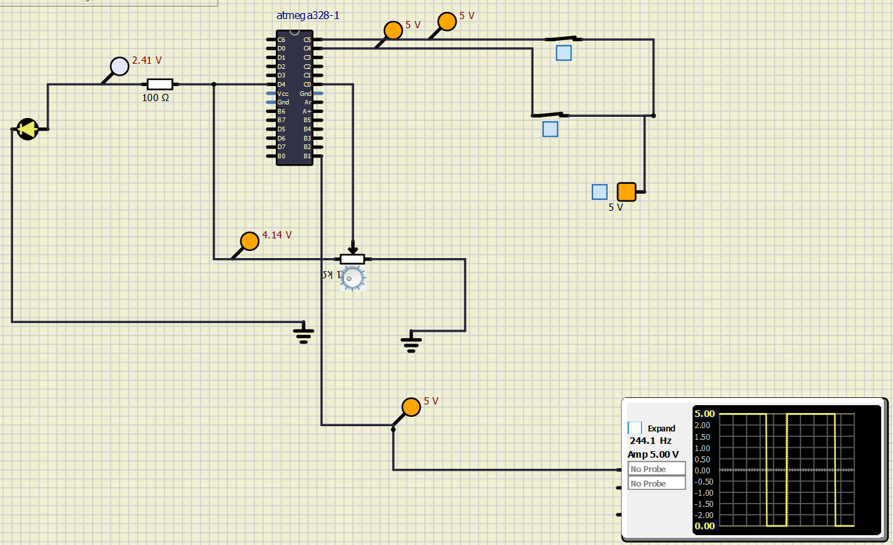
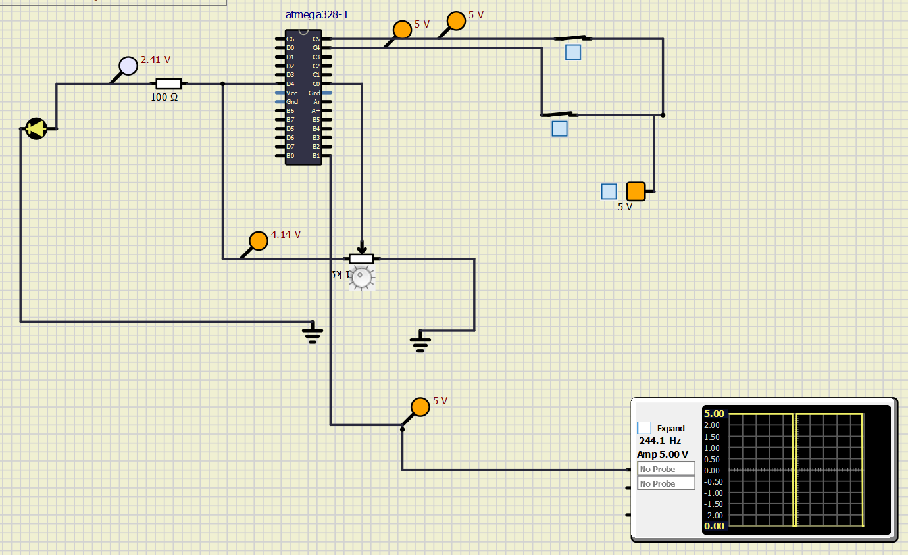
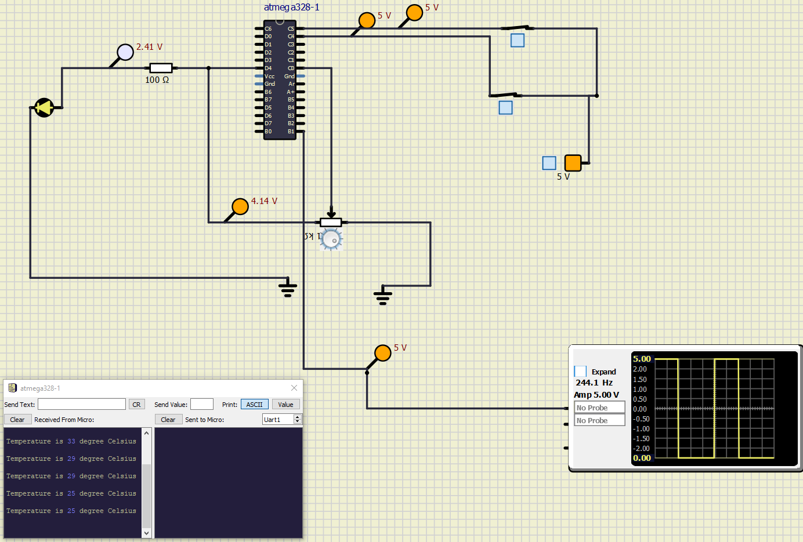
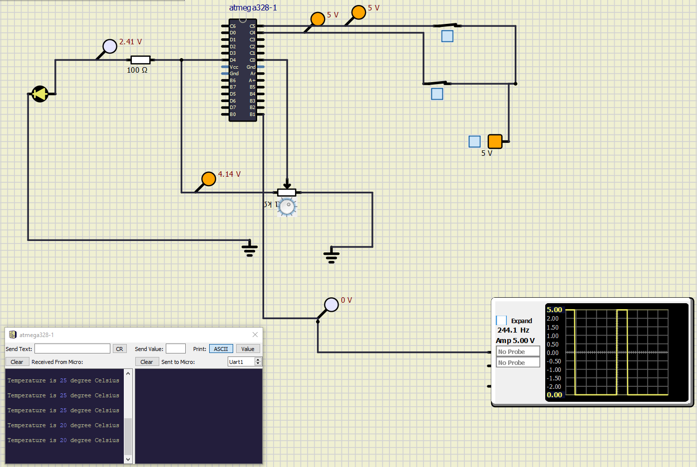

# Embedded C Programming Examples with Continuous Integration and Code Quality

# LED Blinking 

## In Action
## LED ON
| s1 and s2 ON|
:-------------------------:
|.png)|

## LED OFF
| s1 and s2 OFF            |  s1 OFF ,s2 ON |  s1 ON ,s2 OFF|
:-------------------------:|:-------------------------:|:-------------------------:
.png) | .png) | .png)

## ADC READING
| Image1          |  Image2 | Image3|
:-------------------------:|:-------------------------:|:-------------------------:
 |  | 

## PWM
| Image1          |  Image2 | Image3|Image4|
:-------------------------:|:-------------------------:|:-------------------------:|:-------------------------:
 |  | | 

## USART
| Image1          |  Image2 | Image3|Image4|
:-------------------------:|:-------------------------:|:-------------------------:|:-------------------------:
 |  | | 

#### CI and Code Quality

|Build|Cppcheck|Codacy|
|:--:|:--:|:--:|
||||
